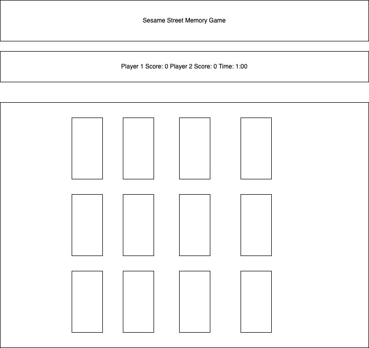

# ApplicationName
Sesame Street Memory Game
## Concept: Find all of the cards before time runs out and Oscar tells you to "SCRAM!"
## Technologies Used:
    - HTML
    - CSS 
    - JavaScript 
    - JQuery
## Approach: 
Overview: Memory game with Sesame Street characters. You must match all the cards before time runs out. If both players tie, the player who matched the cards faster wins!

## Challenges: 
I thought this would be a fairly simple game to build, but I just couldn't figure out how to switch between players. Looking back now, I should have not only been more detailed in my pseudo code, but I should have written in detail how I would solve each step of my program (while loop, Player class, etc). Instead I ended up with a lot of spaghetti code :(
## Additional information: 
I tried really hard :) 
## App Demo 
https://ryreiterman.github.io/sesame-street-memory-game/
